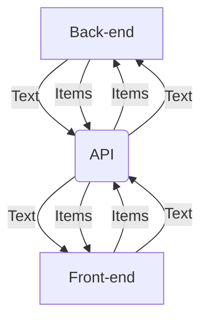
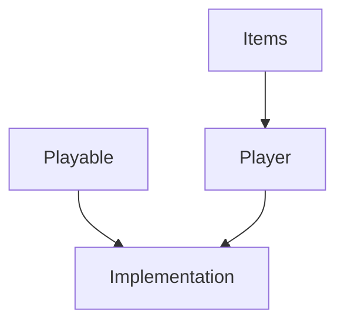
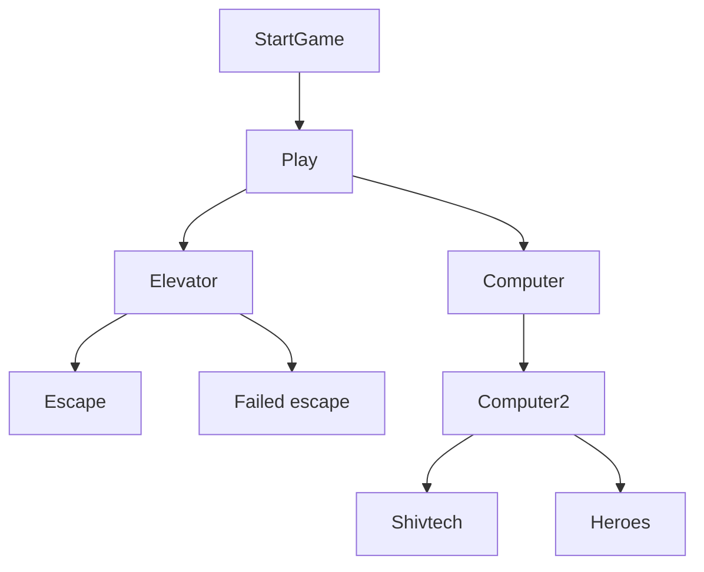

The application has a back-end (java), an API and a front-end (react/typescript).
The general structure of the files is as follows:

There are several lines between the back- and front-end:
1) One passes a number which calls a specific bit of text. 
2) One passes a string which changes the status of 'heldStatus' and 'inPossession' of an item to true.
3) One passes a string which changes the status of 'heldStatus' of an item to true.
4) One passes a string which changes the status of 'inPossession' of an item to false.

The back-end looks like this:

And the front-end looks like this: 

